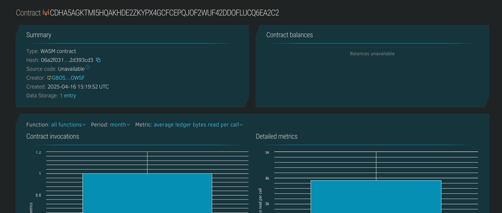

# 🧩 Plastic Collection Tracker

## 📝 Project Description
Plastic Collection Tracker is a blockchain-based system designed to monitor and record plastic waste collection efforts. By utilizing Soroban smart contracts on the Stellar network, this project enables transparent tracking of individual and community contributions toward environmental sustainability. Each collection entry is immutably stored and associated with a contributor's address.

## 🌍 Project Vision
To create a decentralized, transparent, and tamper-proof platform that incentivizes and tracks plastic collection activities, contributing toward a cleaner and greener planet. This system can be further integrated with reward mechanisms to encourage participation.

## ✨ Key Features
- Add new plastic collection entries with contributor info and amount.
- Retrieve specific entries by ID.
- View all collection entries.
- Tracks the total number of collections added.
- Tamper-proof logs of community efforts.

## 🔮 Future Scope
- Integration with token-based rewards for top collectors.
- Geo-tagging support to track regional impact.
- Gamification features like leaderboards and streaks.
- Verified submissions via IoT devices or third-party validation.
- Public dashboards for transparency and community engagement.

## 🛠️ Built With
- [Soroban SDK](https://soroban.stellar.org)
- Stellar Blockchain

## Contract Details
CDHA5AGKTMI5HQAKHDE2ZKYPX4GCFCEPQJOF2WUF42DDOFLUCQ6EA2C2
